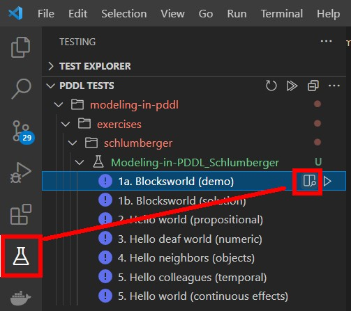

# Basics of modeling in PDDL, Schlumberger

This is from course work authored by Maria Fox and Derek Long and other coworkers in Schlumberger that was created for internal training purposes.

A good way to follow the examples is to use the VS Code Testing pane:

1. Generalizing Blocksworld to multiple grippers to showcase power of declarative modeling
2. Hello world in propositional
3. - numeric,
4. - with types and objects,
5. - temporal and finally
6. - with continuous numeric effects.

This set of classroom exercises is accompanied by a series of videos explaining the
challenges and live-coding the solution:  [Modeling in PDDL, back to the basics](https://www.youtube.com/playlist?list=PL1Q0jeuU6XppS_r2Sa9fzVanpbXKqLsYS).

As mentioned in the video description, the training was created by Maria Fox, [Derek Long](https://github.com/DerekLong101), and other Schlumberger colleagues. The Blocksworld animation site was developed by [Gilles Besancon](https://github.com/gbesancon) and the blocks visualization in VS Code was done by [Filip Dolejsi](https://github.com/FilipDolejsi/ai-planning-state-viz).
